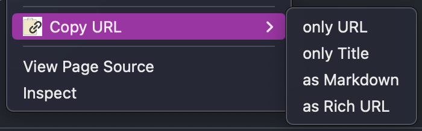
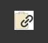

# copy-url

Chrome extension to copy the tab's URL to clipboard.

## Usage

Right click on a webpage and click "Copy URL".

- only URL
  - copies only the page's url
- only Title
  - copies only the title of the page (the `<title>` element value)
- as Markdown
  - copies the url with the title in markdown format (e.g., `[title](url)`)
- as Rich URL
  - copies the url with the title in html hyperlink style

Clicking the extension icon will copy the url with the title in markdown format.
